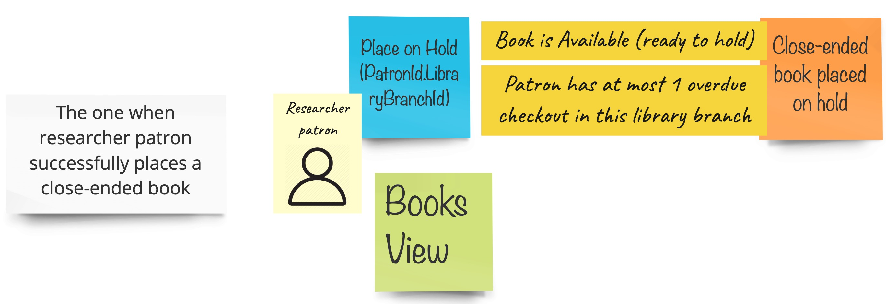

# Design Level EventStorming

As soon as we got our examples written down, we could start digging deep into each of them, identifying key interactions
with the system, spotting the business rules and constantly refining the model. In the following sections you will
find mentioned examples modelled with Design Level EventStorming,

## Holding
### Close-ended book holding

The first example is _the one when regular patron tries to place his 6th hold_:
   
  

What you can see here is that we are assuming, that a particular patron has already placed 5 books on hold.
Next, in order to place one more, a patron needs to interact with _the system_ somehow, so this is the reason
for placing a blue sticky note representing a command called **place on hold**. In order to make such decision,
a patron needs to have some view of the book that can be potentially placed on hold (green sticky note).
Because the regular patron cannot place more than 5 books on hold, we could identify a rule (rectangular yellow sticky note),
that describes conditions that needs to be fulfilled for the **Book hold failed** event to occur.

Fair enough, let's go further.

### Open-ended book holding  

  
  
  
  
  
  
  
  
  
  
  
    

## Canceling a hold

  
  
  
  
  

## Checkout

  
  
  
  
  

## Expiring a hold

  
  
  

## Registering overdue checkout

  
  

## Adding to catalogue

  
  