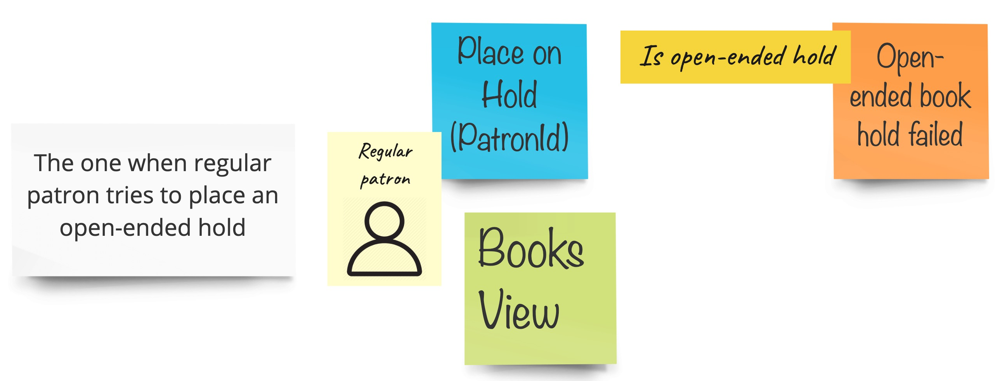
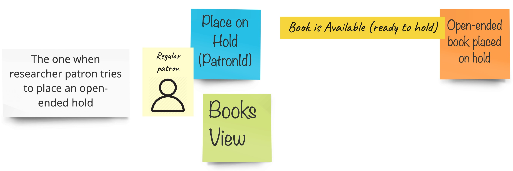

# Design Level EventStorming

As soon as we got our examples written down, we could start digging deep into each of them, identifying key interactions
with the system, spotting business rules and constantly refining the model. In the following sections you will
find mentioned examples modelled with Design Level EventStorming.

## Holding
### Regular patron

The first example is _the one when regular patron tries to place his 6th hold_:
   
  

What you can see here is that we are assuming, that a particular patron has already placed 5 books on hold.
Next, in order to place one more, a patron needs to interact with _the system_ somehow, so this is the reason
for placing a blue sticky note representing a command called **place on hold**. In order to make such decision,
a patron needs to have some view of the book that can be potentially placed on hold (green sticky note).
Because the regular patron cannot place more than 5 books on hold, we could identify a rule (rectangular yellow sticky note),
that describes conditions that needs to be fulfilled for the **Book hold failed** event to occur.

Fair enough, let's go further.

When a **patron** tires to place on hold a book that is currently not available it should not be possible, thus resulting
in **book hold failed** event, as it is depicted below:

  

Taking a look at the domain description again, we find out that each patron can have no more than 1 **overdue checkouts**.
In such situation, every attempt to **place a book on hold** should fail:

  

If we are talking about **regular patrons**, what is special about them is that they are not allowed to hold a
**restricted book**:
  

Second thing that is not allowed for a **regular patron** is **open-ended** hold: 
    

All right, enough with failures, let patrons lend some books, eventually:
  
  

Having in mind all previous examples, we discovered following conditions that need to be fulfilled for **patron** to
**place a book on hold**:
* Book must be available
* Book must not be **restricted**
* At the moment of placing a hold, a patron cannot have more than 4 holds
* Patron cannot have more than 1 overdue checkout

And here is the last example, partially covered before:

  

### Regular patron

In the previous part of this paragraph we focused on a *regular patron* only. Let's have a look at *researcher patron* now.
The domain description clearly states that **any** patron with more than 2 **overdue checkouts** will get a rejection
when trying to place book on hold. So we have it modelled:
  
  

There is also no exception in terms of holding a book that is **not available**:

  

The thing that differentiates **researcher patron** from a **regular** one is that he/she can place on hold a **restricted**
book:

  

Last three examples depict successful holding scenarios:

  
  
    

## Canceling a hold

Any patron can cancel the hold. The unbreakable condition to be fulfilled is the one that the hold exists.
If it is not the case **book hold cancelling failed** event occurs.

  

If the hold is present, then it should be possible to cancel it:

  

We also need to take care of the scenario when a **patron** tries to **cancel a hold** that was actually
not placed by himself/herself:

  

It shouldn't be also possible to **cancel a hold** twice:

  

Getting back to holding-related examples, let's try to join them with hold cancellation. Each **patron** can have no more
than five holds at a particular point in time. Thus, cancelling one of them should be enough for **patron** to **place
on hold** another book:
  
  

## Checkout

Checking out is actually the essence of library functioning. **Any patron** can checkout a hold, but it is only possible
when the **hold** exists:
 
  

It is also not allowed to checkout someone else's hold:

  

An example summing things up is depicted below:

  

A real-life scenario could be that a **patron** cancels his/her hold, and tries to check the book out:
 
  

It might also happen that a **patron** has the hold, whereas the book is missing in a library:
  
  

## Expiring a hold

According to the domain description, any **close-ended hold** is active until it is either checked out by **patron** or
expired. The expiration check is done automatically by the system at the **beginning of the day**:

  

When the book is **placed on hold** and the hold is **cancelled** before its expiration due date, it shouldn't be registered
as expired hold:

  

The expiration check should mark each hold as expired only once:

  

## Registering overdue checkout

  
  

## Adding to catalogue

  
  